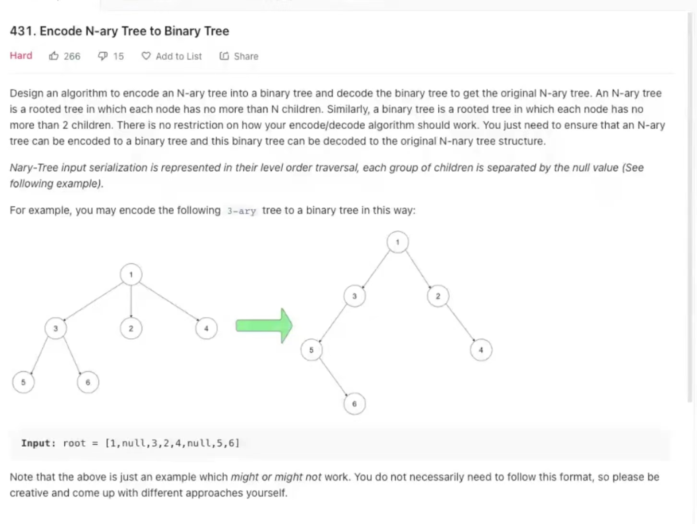

# Encode N-ary Tree to Binary Tree



`Hard`

```java
public class Code03_EncodeNaryTreeToBinaryTree {

	// 提交时不要提交这个类
	public static class Node {
		public int val;
		public List<Node> children;

		public Node() {
		}

		public Node(int _val) {
			val = _val;
		}

		public Node(int _val, List<Node> _children) {
			val = _val;
			children = _children;
		}
	};

	// 提交时不要提交这个类
	public static class TreeNode {
		int val;
		TreeNode left;
		TreeNode right;

		TreeNode(int x) {
			val = x;
		}
	}

	// 只提交这个类即可
	class Codec {
		// Encodes an n-ary tree to a binary tree.
		public TreeNode encode(Node root) {
			if (root == null) {
				return null;
			}
			TreeNode head = new TreeNode(root.val);
			head.left = en(root.children);
			return head;
		}

		private TreeNode en(List<Node> children) {
			TreeNode head = null;
			TreeNode cur = null;
			for (Node child : children) {
				TreeNode tNode = new TreeNode(child.val);
				if (head == null) {
					head = tNode;
				} else {
					cur.right = tNode;
				}
				cur = tNode;
				cur.left = en(child.children);
			}
			return head;
		}

		// Decodes your binary tree to an n-ary tree.
		public Node decode(TreeNode root) {
			if (root == null) {
				return null;
			}
			return new Node(root.val, de(root.left));
		}

		public List<Node> de(TreeNode root) {
			List<Node> children = new ArrayList<>();
			while (root != null) {
				Node cur = new Node(root.val, de(root.left));
				children.add(cur);
				root = root.right;
			}
			return children;
		}

	}

}

```

