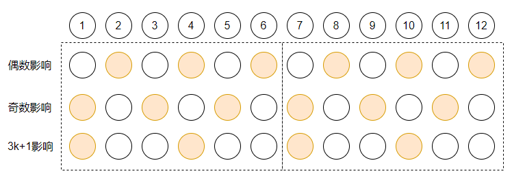
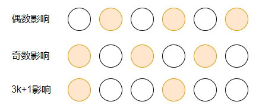
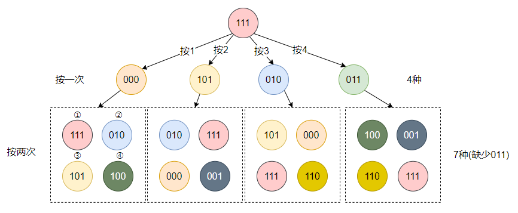

# [672. 灯泡开关 Ⅱ](https://leetcode.cn/problems/bulb-switcher-ii/)

难度中等

房间中有 `n` 只已经打开的灯泡，编号从 `1` 到 `n` 。墙上挂着 **4 个开关** 。

这 4 个开关各自都具有不同的功能，其中：

- **开关 1 ：**反转当前所有灯的状态（即开变为关，关变为开）
- **开关 2 ：**反转编号为偶数的灯的状态（即 `2, 4, ...`）
- **开关 3 ：**反转编号为奇数的灯的状态（即 `1, 3, ...`）
- **开关 4 ：**反转编号为 `j = 3k + 1` 的灯的状态，其中 `k = 0, 1, 2, ...`（即 `1, 4, 7, 10, ...`）

你必须 **恰好** 按压开关 `presses` 次。每次按压，你都需要从 4 个开关中选出一个来执行按压操作。

给你两个整数 `n` 和 `presses` ，执行完所有按压之后，返回 **不同可能状态** 的数量。

 

**示例 1：**

```
输入：n = 1, presses = 1
输出：2
解释：状态可以是：
- 按压开关 1 ，[关]
- 按压开关 2 ，[开]
```

**示例 2：**

```
输入：n = 2, presses = 1
输出：3
解释：状态可以是：
- 按压开关 1 ，[关, 关]
- 按压开关 2 ，[开, 关]
- 按压开关 3 ，[关, 开]
```

**示例 3：**

```
输入：n = 3, presses = 1
输出：4
解释：状态可以是：
- 按压开关 1 ，[关, 关, 关]
- 按压开关 2 ，[关, 开, 关]
- 按压开关 3 ，[开, 关, 开]
- 按压开关 4 ，[关, 开, 开]
```

 

**提示：**

- `1 <= n <= 1000`
- `0 <= presses <= 1000`


## 方法一：降低搜索空间

思路

如果不进行任何优化进行搜索，需要按 presses 次，每次有 4 种选择，那么一共有 $4^\textit{presses}$  种按动选择，每种选择消耗 $O(n)$ 时间计算状态，则最终的时间复杂度为 :
$$
O(n \times 4^ \textit{presses})
$$


经过思考，可以从以下角度降低搜索空间。

首先，不需要考虑按钮按动的顺序，而只需要考虑每个按钮被按了几次，在按钮按动次数一样的情况下，顺序不影响灯泡最后的状态。

更进一步地，不需要考虑每个按钮具体被按了几次，而只需要考虑被按了奇数次还是偶数次即可，某个键每多按或少按 2 次及其倍数次，也不影响最后的状态。

其次，观察每个按钮的效果，可以发现所有按钮可以根据编号划分为以下 4 组，周期为 6，下列编号中 $k \geq 0$：

编号为 $6k+1$，受按钮 $1,3,4$ 影响；
编号为 $6k+2, 6k+6$，受按钮 $1,2$ 影响；
编号为 $6k+3, 6k+5$，受按钮 $1,3$ 影响；
编号为 $6k+4$，受按钮 $1,2,4$ 影响。
因此，只需要考虑四个灯泡，即可知道所有灯泡最后的状态了。

编写代码时，可以用一个长度为 $4$ 数组 $\textit{pressArr}$ 表示 $4$ 个按钮的按动情况。一个整数 $\textit{status}$ 表示四组灯泡亮灭的状态。最后计算遇到过几种不同的状态即可。

```java
class Solution {
    public int flipLights(int n, int presses) {
        
        // 定义 seen
        Set<Integer> seen = new HashSet<>();
        
        // 每个按钮 2 种状态， 组合就是 16 种状态
        for (int i = 0; i < 1 << 4; i++) {
            
            // 定义 pressArr 数组，长度为 4
            // 用来表示 4 个按钮的按动情况
            int[] pressArr = new int[4];
            
            // 每一种状态，判断4个开关状态，按 -》 1 不按 -》 0
            for (int j = 0; j < 4; j++) {
                pressArr[j] = (i >> j) & 1;
            }
            
            // 统计最后处于按状态的开关个数
            int sum = Arrays.stream(pressArr).sum();
            
            // 最终灯状态按的状态大于要求的次数时，不符合要求，直接遗弃 sum > presses
            // 按的次数和要求的次数，必须同为奇数或者偶数，否则状态失效， 说明按的次数和要求的次数是不匹配的
            if (sum % 2 == presses % 2 && sum <= presses) {
                // 初始状态只有 1 栈或 3 栈灯亮， status 才为 1
                int status = pressArr[0] ^ pressArr[1] ^ pressArr[3];
                
                // status 的意思很明显，意味着4组灯亮灭状态
                if (n >= 2) {
                    status |= (pressArr[0] ^ pressArr[1]) << 1;
                }
                if (n >= 3) {
                    status |= (pressArr[0] ^ pressArr[2]) << 2;
                }
                if (n >= 4) {
                    status |= (pressArr[0] ^ pressArr[1] ^ pressArr[3]) << 3;
                }
                
                // 添加当前 status 到结果集中
                seen.add(status);
            }
        }
        
        // 返回 status 的个数
        return seen.size();
    }
}
```


## 找规律

根据题意，我们先找到每个开关影响的灯



如图所示，两个虚框的灯的状态完全一致，因此我们任意取一盏灯i，则i的状态和i + 6的状态完全一致，所以灯的状态的周期T = 6

因此我们只需要观察前六盏灯的状态。



我们设六盏灯的编号为6k+1、6k+2、6k+3、6k+4、6k+5、6k+6，则

6k+1 会受到1、3、4开关的影响
6k+2会受到1、2开关的影响
6k+3会受到1、3开关的影响
6k+4会受到1、2、4开关的影响
6k+5会受到1、3开关的影响
6k+6会受到1、2开关的影响
由于6k+2和6k+6都受到1、2开关的影响，因此两盏灯的状态一致
由于6k+3和6k+5都受到1、3开关的影响，因此两盏灯的状态一致

因此我们只需要观察前4盏灯的状态。

进一步，我们设按下4种开关的次数分别为a、b、c、d，由于偶数次按压相当于没按，所以有
①6k+1的状态为(a + c + d) % 2
②6k+2的状态为(a + b) % 2
③6k+3的状态为(a + c) % 2
④6k+4的状态为(a + b + d) % 2

由于①和③都受到1、3开关的影响，所以若①③状态相同，则d必然为偶数；若①③状态不同，则d必然为奇数

由于②和④都受到1、2开关的影响，并且④和d有关系，所以若d为偶数，则②④状态相同；若d为奇数，则②④状态不同

所以我们可以通过①②③的状态来确定④的状态

因此我们只需要观察前3盏灯的状态。

设前三盏灯开始的状态为111，我们最开始枚举状态，最多也就8种（每个灯只有亮和不亮）




以此类推，011可以由111获得，因此当presses >= 3时 可以获得8种

综上：
当 $n = 1$ 时，开关1、3、4 对其造成影响，也只有开和关两种状态
当 $n = 2$  时，按照推理 111 的状态推理 11，按一次有 3 种，按 2 次及以上有 4 种。
当$n = 3$ 时，按一次有 4 种，按 2次及以上有 7 种, 3次及以上有 8 种。

```java
public class Solution {

    public int flipLights(int n, int presses) {
        if (presses == 0) {
            return 1;
        }
        
        if (n == 1) {
            return 2;
        }
        
        if (n == 2) {
            return presses == 1 ? 3 : 4;
        }
        
        return presses == 1 ? 4 : presses == 2 ? 7 : 8;
    }
}
```


&nbsp;


